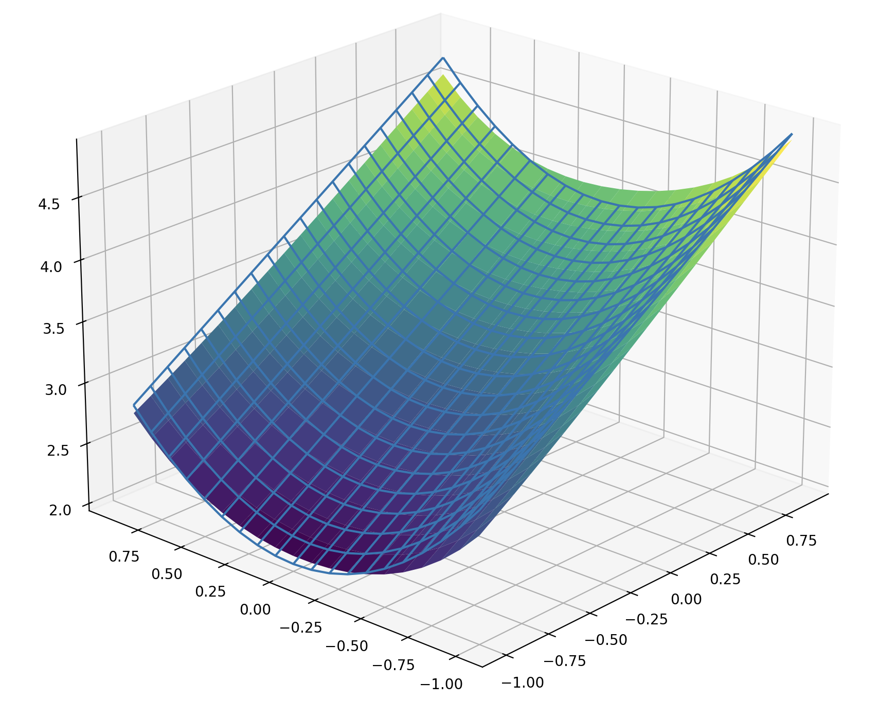
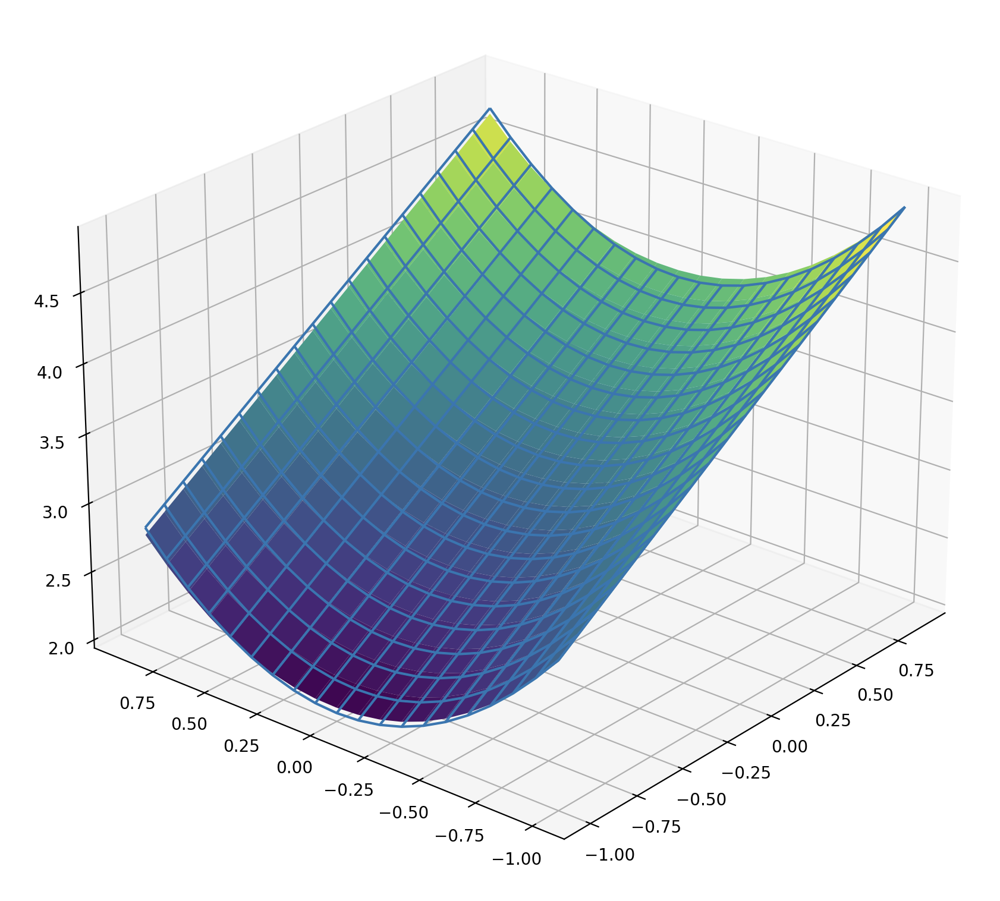
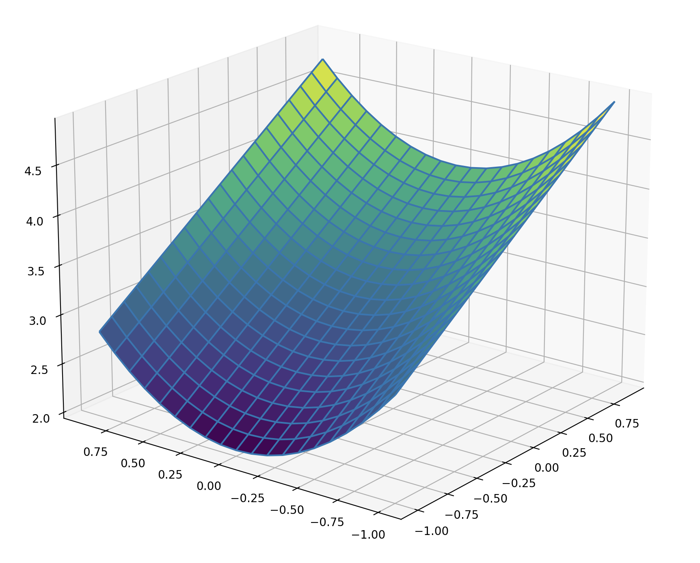

How did Galileo discover that objects fall with constant acceleration? In the late 1500s, Galileo set out to disprove Aristotle's theory that objects fall at a constant rate---a somewhat concerning view from one who fathered the modern scientific method, and had presumably seen things fall before. To do so, he dropped two balls off of the leaning tower of Pisa as anyone with a personal investment in gravitational physics looked on eagerly. Collecting one datapoint (i.e. the duration of the fall), he concluded that he was in fact correct, and gravity is characterised by a constant 
"aggiunta di velocità", which presumably means "acceleration" in Italian. Had he collected more datapoints and used this python package that we developed, he might have more accurately concluded that acceleration is given by $\frac{dv}{dt} = g - \frac{bv}{m}$, taking air resistance into account.

This problem, involving taking a set of datapoints and converting it into a symbolic equation, is known as symbolic regression. It is famously difficult problem, as there is no known method of enumerating all possible analytical functions, much less a way to search through that space. While it is possible to train a black-box function to approximate the underlying function of some given dataset, there is no known mapping from that learned representation to an analytical form. This is the very problem we set out to tackle in this project: taking a learning-based approach, we wish to incrementally convert black-box functions into an analytical form, eventually recovering a fully symbolic expression.

Crucial to this approach is the manner in which the desired function is represented. One important piece of intuition is that any function can be represented as a *tree*, where each non-leaf node is some univariate (*e.g.* $\log(x)$, $\exp(x)$, $sin(x)$, $ax+b$, etc) or multivariate (*e.g.* $\sum$, $\prod$, etc) operation. In a fully symbolic equation, each leaf node is simply one of the input variables $x_0, x_1, \ldots, x_n$. However, we can also represent *mixed* representations that contain both symbolic and black-box components by using black-box functions for a subset of the leaf nodes (*e.g.* $f_0(x_1)$, $f_1(x_0, x_2)$, etc). In this manner, we can generalise between fully symbolic representations (where all leaf nodes are symbolic variables) and fully black-box representations (where the graph contains a single node, which is a function of all input variables $f_0(x_0, x_1, \ldots, x_n)$).

This representation enables a unique approach to symbolic regression, composed by a hybrid of learning and search-based optimisation. Learning is used to optimise a given tree representation, which can contain both learnable black-box leaf nodes and learnable grey-box nodes containing univariate operations with learnable parameters. On the other hand, search is used to test new nodes to add to a given tree representation (*i.e.* finding the best univariate or multivariate operation to replace a black-box node). This mix of gradient descent and search provides advantages that either one does not have on its own: gradient descent enables optimisation in continuous parameter space, while search provides robustness to nonconvex optimisation, in much the same way that a genetic algorithm would. For example, if we were to use a purely learning-based method to represent a sinusoid, then a parabola that locally fits the curve could serve as a local optimum---one that could be avoided if we were to attempt training with a grey-box sinusoid in addition to the parabola and compare the losses.

While this hybrid approach might be probabilistically complete, it requires that we eventually guess the correct tree structure for a given function. In order to complete the task in a realistic amount of time, there needs to be some mechanism to guide the search. As we previously alluded to, one metric to evaluate the quality of a given representation is simply through the loss of the trained model. A black-box function represented by an MLP with a finite number of parameters has a limited amount of representational complexity, so it is a reasonable assumption that the loss should be lower when the black-box model needs to represent "simpler" functions (*i.e.* one would expect an MLP to represent $f(x)=x$ more accurately than $f(x)=\log(x)$). Consequently, tree representations with more "correct" guesses of symbolic nodes should yield a lower loss, providing a fitness metric that can guide our search.

In addition to loss, we introduce one more piece of intuition that can guide the search process: the notion of separability. We note that if a function $f$ is linearly separable between variables $x_0$ and $x_1$ (*i.e.* it takes the form $f(x_0, x_1) = g_0(x_0) + g_1(x_1)$), then it obeys the property $\frac{\partial}{\partial x_0} \frac{\partial}{\partial x_1} f = 0$. Similarly, if a function $f$ is multiplicatively separable (*i.e* it takes the form $f(x_0, x_1) = g_0(x_0) \cdot g_1(x_1)$), then it obeys the property $\frac{\partial}{\partial x_1} \frac{\frac{\partial}{\partial x_0} f(x_0, x_1)}{f(x_0, x_1)} = 0$. Indeed, we can prove that the converse of these statements is also true:

$$\frac{\partial}{\partial x_i}\frac{\partial}{\partial x_j} h(\vec{x}) = 0 \implies h(\vec{x}) = C_1(x_i) + C_2(x_j)$$

> Proof:
$$ \int \int \frac{\partial}{\partial x_i}\frac{\partial}{\partial x_j} h(\vec{x}) \, dx_j \, dx_i = 0 $$
$$ \int \frac{\partial}{\partial x_i} h(\vec{x}) + C_0(x_i) \, dx_i = 0$$
$$ \left( C_1(x_i) = \int C_0(x_i) \, dx_i \right) $$
$$ h(\vec{x}) = C_1(x_i) + C_2(x_j) $$

$$\frac{\partial}{\partial x_i} \frac{\frac{\partial}{\partial x_j} h(\vec{x})}{h(\vec{x})} = 0 \implies h(\vec{x}) = C_3(x_i) \cdot C_4(x_j)$$

> Proof:
$$\int\int \frac{\partial}{\partial x_i} \frac{\frac{\partial}{\partial x_j} h(\vec{x})}{h(\vec{x})} \, dx_j \, dx_i = 0 $$
$$ \int \frac{\partial}{\partial x_i} \ln\left({h(\vec{x})}\right) + C_0(x_i) \, dx_i = 0 $$ 
$$ \ln\left({h(\vec{x})}\right) + C_1(x_i) + C_2(x_j) = 0 $$
$$ \ln(h(\vec{x})) = -C_1(x_i) + C_2(x_j)$$
$$ h(\vec{x}) = e^{-C_1(x_i) - C_2(x_j)} $$
$$ \left( C_1(x_i) = \int C_0(x_i) \, dx_i), \, C_3(x_i) = e^{-C_1(x_i)}, \,\, C_4(x_j) = e^{-C_2(x_j)} \right) $$
$$ h(\vec{x}) = C_3(x_i) \cdot C_4(x_j) $$

Using this property, we can create a test for the separability of a given black-box leaf node. This tells us not only whether to use a univariate or multivariate operation, but also *which* multivariate operation to use if it is the latter. Furthermore, it explicitly dictates which subsets we can partition the set of input variables into. By applying the separability checks between each pair of variables, we obtain a matrix where elements are zero if they are separable (in the case of additive separability, this is simply the Hessian matrix). Thresholding this matrix yields an adjacency matrix where each link represents a non-separable connection between two variables. Now, to identify the set of non-separable functions over subsets of the input variables (which represent the black-box child nodes of the multivariate node we are adding), we must find the set of all fully connected subgraphs. This is known as the "clique problem", a solution for which comes pre-implemented in most graph-reasoning libraries (in practice, we use networkx).

As a case study, let us consider the equation:

$$ f(x_0, x_1, x_2) = x_0 + 3 + (x_1 - x_2)^2$$

We wish to use our symbolic regression method to recover this equation given inputs and outputs of this function. To start the process, we initialise a tree with a single learnable black box function at the root node. After training this root node to represent the data, we can run our additive and multiplicative separability tests. Since the absolute scale of the derivatives don't matter, we normalise by the largest value in the matrix:

**Additive Separability Matrix**: $f(x_0, x_1, x_2) = x_0 + 3 + (x_1 - x_2)^2$
```python
[[0.0191, 0.0082, 0.0075],
[0.0082, 0.8789, 0.5029],
[0.0075, 0.5029, 1.0000]]
```

**Multiplicative Separability Matrix**: $f(x_0, x_1, x_2) = x_0 + 3 + (x_1 - x_2)^2$
```python
[[0.1429, 0.2476, 0.2453],
[0.2476, 0.9939, 1.0000],
[0.2453, 1.0000, 0.9939]]
```

Thresholding these matrices, we obtain adjacency matrices for the graphs corresponding to elements that are additively or multiplicatively entagled. Note that we always assume that the diagonal is filled with ones, as there is no meaning to a variable being "separable from itself".

**Additive Separability Graph**: $f(x_0, x_1, x_2) = x_0 + 3 + (x_1 - x_2)^2$
```python
[[1, 0, 0],
[0, 1, 1],
[0, 1, 1]]
```

**Multiplicative Separability Graph**: $f(x_0, x_1, x_2) = x_0 + 3 + (x_1 - x_2)^2$
```python
[[1, 1, 1],
[1, 1, 1],
[1, 1, 1]]
```

This implies that the element $x_0$ is additively separable from $x_1$ and $x_2$. By inspection of the ground truth equation, we can verify that it can be represented in the form f(x_0, x_1, x_2) = g_1(x_0) + g_2(x_1, x_2). 

If we instead run the same experiment with the function $f(x_0, x_1, x_2) = (x_0 + 3) \cdot (x_1 - x_2)$, then the separability results change significantly:

**Additive Separability Matrix**: $f(x_0, x_1, x_2) = (x_0 + 3) \cdot (x_1 - x_2)$
```python
[[1.0000, 0.3967, 0.3967],
[0.3967, 0.0706, 0.0698],
[0.3967, 0.0698, 0.0702]]
```

**Multiplicative Separability Matrix**: $f(x_0, x_1, x_2) = (x_0 + 3) \cdot (x_1 - x_2)$
```python
[[0.0000, 0.0017, 0.0017],
[0.0017, 1.0000, 0.9995],
[0.0017, 0.9995, 0.9990]]
```

**Additive Separability Graph**: $f(x_0, x_1, x_2) = (x_0 + 3) \cdot (x_1 - x_2)$
```python
[[1, 1, 1],
[1, 1, 0],
[1, 0, 1]]
```

**Multiplicative Separability Graph**: $f(x_0, x_1, x_2) = (x_0 + 3) \cdot (x_1 - x_2)$
```python
[[1, 0, 0],
[0, 1, 1],
[0, 1, 1]]
```

In this case, the separability test indicates that the equation can be represented in the form $f(x_0, x_1, x_2) = g_1(x_0, x_1) + g_2(x_0, x_2)$ OR the form $f(x_0, x_1, x_2) = h_1(x_0) \cdot h_2(x_1, x_2)$. We can verify this by choosing $g_1(x_0,x_2)=x_1 \cdot (x_0 + 3)$,  $g_2(x_0,x_2)=-x_2 \cdot (x_0 + 3)$ or $h_1(x_0)=x_0+3$,  $h_2(x_1, x_2) = x_1-x_2$. In this scenario, since the multiplicative case performs more separation (*i.e.* there are fewer edges in the separability graph), we would choose that form.

Returning to the original equation $f(x_0, x_1, x_2) = x_0 + 3 + (x_1 - x_2)^2$, let us visualise the process of regression. After training the root node, we can query the symbolic representation at this stage in training (returned as a sympy expression):

```python
f.symbolic()
```
> `f_0(x_0, x_1, x_2)`

That is fairly boring---but predictably so, as the symbolic tree currently only consists of a black box node. We can also visualise this function by plotting it over the input space. Since this function is three dimensional and we can only plot functions from $\mathbb{R}^2 \to \mathbb{R}$, we instead plot the function $\phi(x_0,x_1) = f(x_0, x_1, 0)$ (*i.e.* we plot a "slice" of the function over only the first two inputs, where the third input is conditioned to be $0$).



After the first iteration of training, the algorithm identifies that the expression is additively separable (as we demonstrated with the separability matrix). Subsequently, finding that it is no longer possible to separate variables in the subexpressions, the algorithm attempts to add univariate nodes to the graph. After training several possibilities, it selects $x^a$ as the best possibility, and trains the parameter $a$ in that grey-box node. Querying the new symbolic representation yields:

```python
f.symbolic()
```
> `f_0(x_0) + 1.6548810005188*f_1(x_1, x_2)**2.08383822441101 - 0.0643232762813568`

While the coefficients of this equation are not correct, this is expected behaviour. Since the leaf nodes are still represented by black-box functions, there is no need to choose the correct coefficients in order to yield the correct results. For example, even though the correct constant term is $3$, the current value of $-0.0643$ can be offset by a value of $3.0643$ in $f_0(x_0)$ or $f_1(x_1, x_2)$ (or a combination of the two). However, note that the exponent is approaching the desired value of $2$. This happens because it is easier for $f_1$ to represent simpler functions, so there is an inductive bias that incentivises the grey box node to choose the proper exponent.

At this stage in training, we again visualise the function that has been learned so far:



Since more of the complexity of the function is handled by the symbolic parts, this approximation is much more accurate.

After a couple more iterations, we reach the end of the training process. This time, with a full symbolic tree that contains no black-box nodes, the correct coefficients must be learned in order to minimise the loss. Indeed, if we query the learned symbolic representation, we get an extremely accurate result:

```python
f.symbolic()
```
> `1.00000047683716*x_0 + 0.999999403953677*(x_1 - x_2 + 1.19209325077929e-7)**1.99999988079071 + 2.99999952316284`

Visualising this expression, we get:



Rounding the coefficients in this expression to the nearest $10^{-5}$, we get the correct answer: $x_0 + (x_1 - x_2)^2 + 3$.

This is an exciting result, because symbolic regression has long been regarded as an extremely difficult problem. It can be used to uncover fundamental laws about the universe, or to explain the behaviour of black-box systems. While most existing methods result to searches over discrete sets of options, this method incorporates a gradient descent-based approach. While it has not *solved* the problem of symbolic regression, it does push the research frontier by introducing a new idea. In the future, this work can be extended---in particular it would be interesting to use the separability criterion not only for selecting between node choices, but also as an auxiliarly loss to guide the learning process (*e.g.* for an expression $(x_0-x_1)^a$, the separability loss can find the value of $a$ such that the subexpression is separable).

