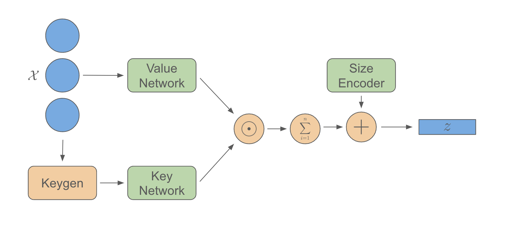
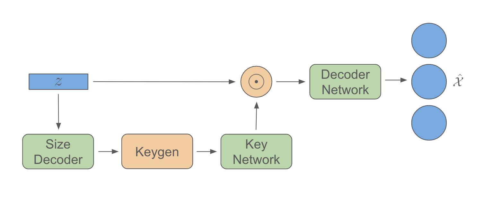
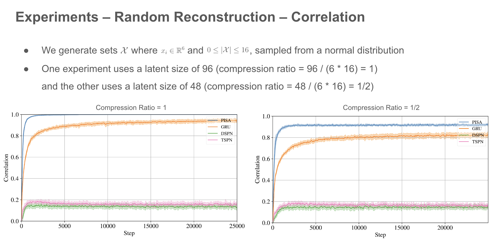
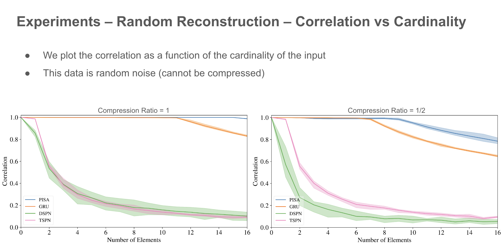
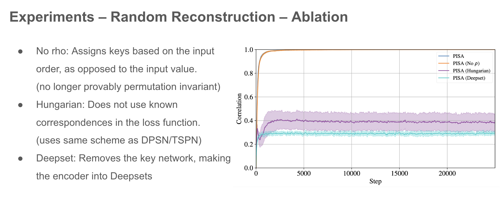
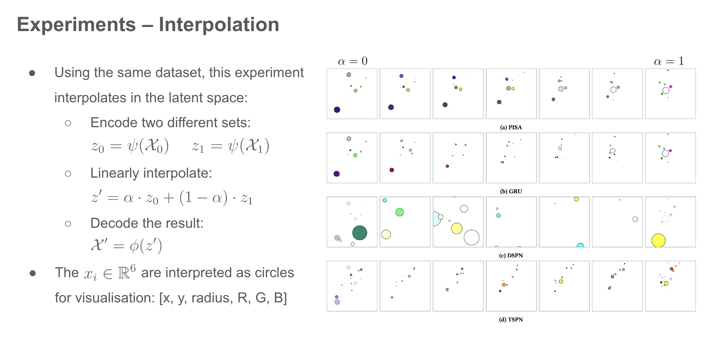
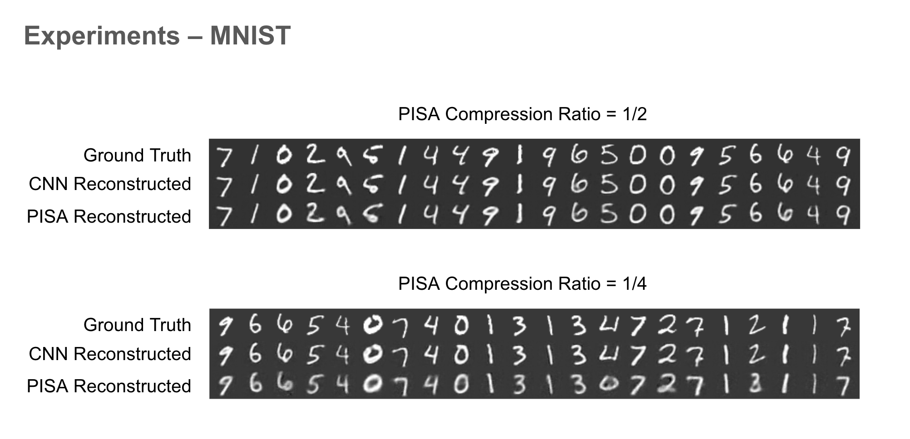
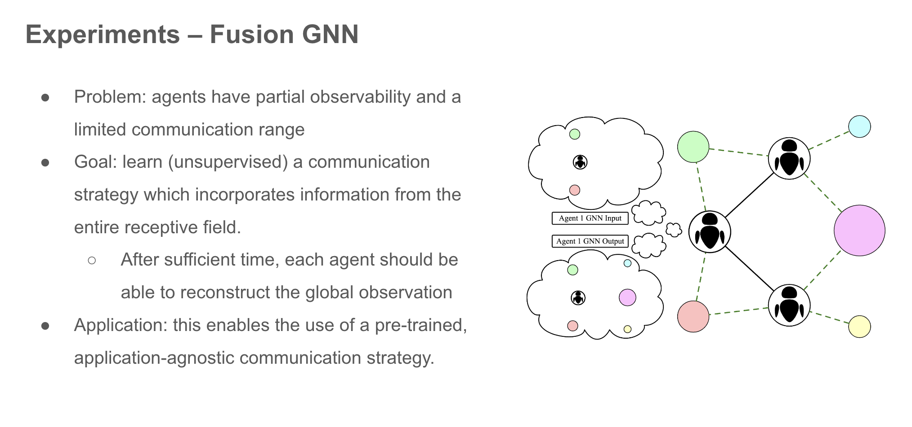
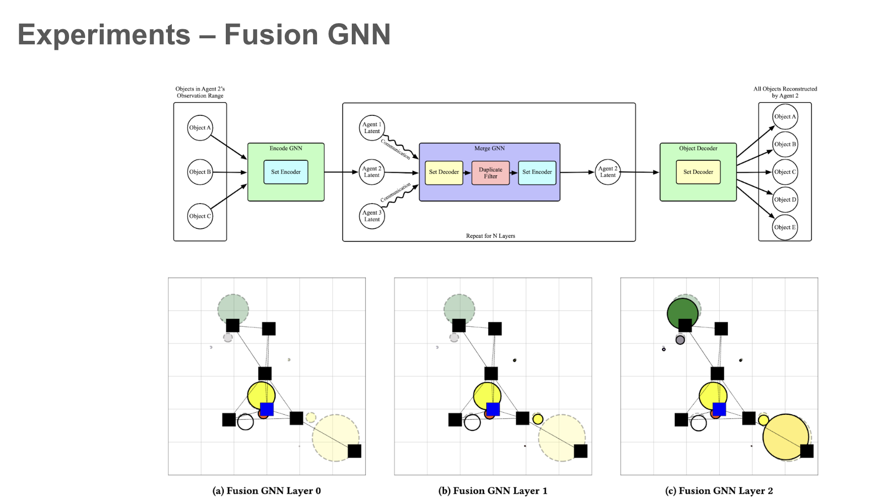

## Introduction

While set encoders have existed for some time (such as Deep Sets), there is currently no good method for decoding sets in prior literature. The difficulty of this problem stems from the fact that sets have no ordering and a variable number of elements, while standard neural networks produce a fixed number of outputs with a definite ordering. There are some networks which can produce a variable number of outputs (like RNNs or Transformers), but they output values sequentially, and they impose an ordering.

We propse PISA, a _set autoencoder_ that can encode a variable-size set of input elements into a fixed-size embedding, and decode fixed-size embeddings into variable-size output sets.

Set Decoder Tasks:
- Prediction of multiple objects in a scene (e.g. objects = {blob at [-1,1], blob at [1,0]})
- Generative models where it is possible to have multiple outputs at a time (_e.g._ generating musical scores, which can have multiple overlapping notes)

Autoencoder Tasks:
- Training communication in a GNN without a downstream objective
- Pre-training an encoder for a team of agents to produce a global state

We provide two models: AutoEncoder, and AutoEncoderPos. They are identical, except that AutoEncoder uses a one-hot representation for keys, while AutoEncoderPos uses a sinusoidal (also known as "positional") embedding. This allows the AutoEncoderPos model to operate without specifying a "maximum size" a priori. However, the standard AutoEncoder trains faster, and in general exhibits slightly better performance.

## Installation

```bash
cd sae
pip install -e .
```

## Basic Usage

To allow batch processing with sets of variable size, PISA operates in a sparse fashion. The input to the encoder is specified by `x` of size (num_elements x dim), representing the input elements from _all_ batches, and `batch` of size (num_elements), which represents the batch to which each input element belongs. The output `z` is of size (num_batch x hidden_dim), where each `z[i,:]` represents the embedding of all elements `x[j,:]` such that `index[j]=i`. The number of batches will be inferred, but it can also be explicitly specified by input parameter `n_batches` (which is useful in cases where the inferred number of batches might be incorrect due to some batches having 0 elements).

The set decoder takes in the embeddings `z`, and outputs the reconstructed inputs `xr` and batch `batchr`. Note that the outputs will be in a different order than the inputs. To directly compare the outputs to the inputs, we can obtain the permutation that was internally applied to the inputs with `model.encoder.get_x_perm()`.

As shown in the following example, we also provide two pretrained weights for `AutoEncoder` and `AutoEncoderPos` for the case `dim=16`, `max_n=16`, `hidden_dim=256`.

```python
name = "sae_pos"
dim = 16
max_n = 16
hidden_dim = 256

# sae = AutoEncoder(dim=dim, hidden_dim=hidden_dim, max_n=max_n)
sae = AutoEncoderPos(dim=dim, hidden_dim=hidden_dim)

model_path = model_path_base.format(name=name, dim=dim, max_n=max_n, hidden_dim=hidden_dim)
sae_state_dict = torch.load(model_path, map_location="cpu")
sae.load_state_dict(sae_state_dict)

n = torch.randint(size=(1,), low=1, high=16)
x = torch.randn(n, dim)
batch = torch.zeros(x.shape[0])

z = sae.encoder(x, batch, n_batches=1)
xr, batchr = sae.decoder(z)

perm = sae.encoder.get_x_perm()
x = x[perm,:]
	
max_err_norm = torch.max((x - xr).norm(dim=-1) / x.norm(dim=-1))

print("Max Normalised Error:", max_err_norm.detach())
```
>```
>Max Normalised Error: tensor(0.0274)
>```

## Training
```python
from sae import AutoEncoder

max_n = 16
hidden_dim = 96
dim = 6

model = AutoEncoder(dim=dim, hidden_dim=hidden_dim, max_n=max_n)

data_list = []
size_list = []
for i in range(batch_size):
  n = torch.randint(low=1, high=max_n, size=(1,))
  x = torch.randn(n[0], dim)
  data_list.append(x)
  size_list.append(n)
x = torch.cat(data_list, dim=0)
sizes = torch.cat(size_list, dim=0)
batch = torch.arange(sizes.numel()).repeat_interleave(sizes)

x = x.to(device)
batch = batch.to(device)

xr, batchr = model(x, batch)

loss_data = model.loss()
loss = loss_data["loss"]

loss.backward()
optim.step()

optim.zero_grad()
```

## Architecture




## Results







